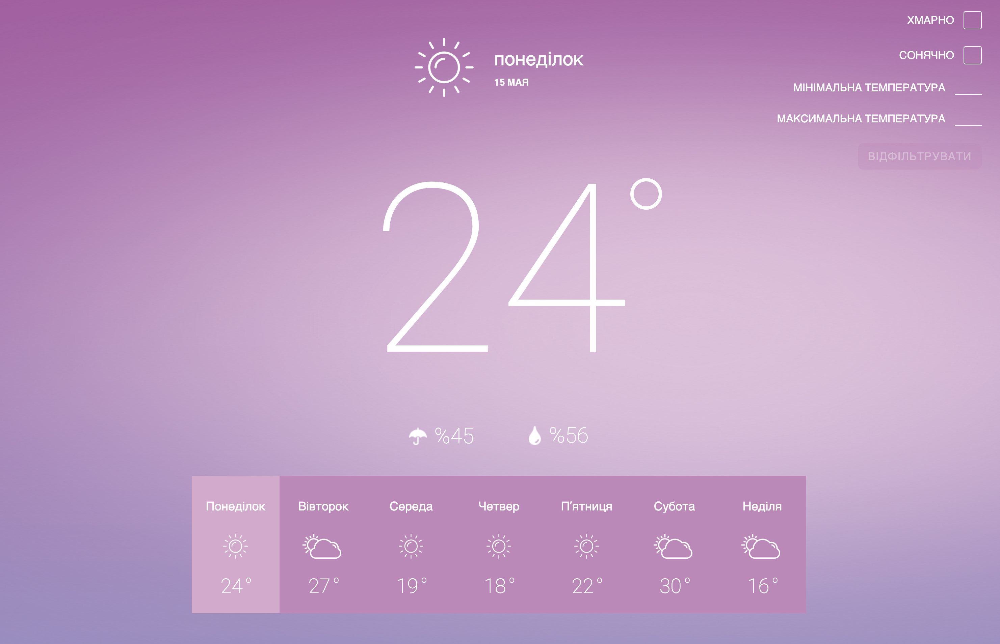

# [Weather Widget](https://sfounder.github.io/weather-widget.github.io/)



### Tech Stack

* HTML & SCSS
* React
* React Query
* MobX

### Як запустити додаток локально:

1. Для встановлення залежностей виконай:

```sh
yarn
# або
npm i
```

2. Для запуску проекту виконай:

```sh
yarn dev
# або
npm run dev
```

3. Для складання проекту виконай:

```sh
yarn build
# або
npm run build
```

4. Для запуску проекту в режимі `production` виконай:

```sh
yarn build && yarn start  
# або
npm run build && npm run start
```

